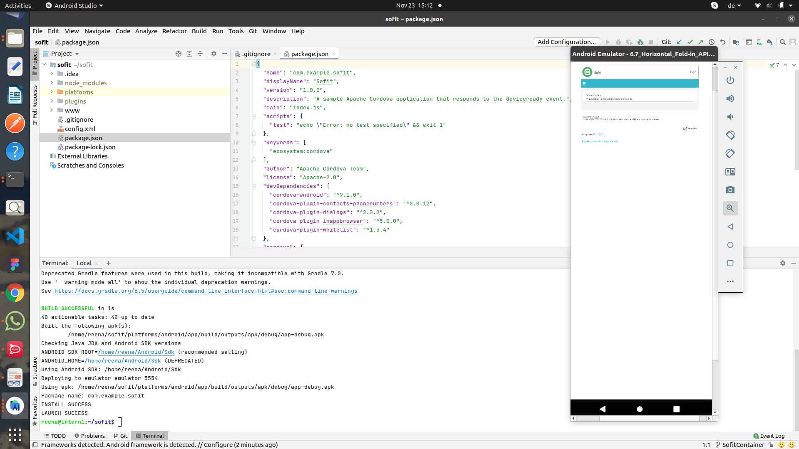

# SofitContainer
>This Guide will show you how to convert Web Application <strong>Sofit</strong> into Apache Cordova app. Basically, it allows you to use standard web technologies like HTML5, CSS3, and JavaScript for cross platform development. So, it will wrap to targeted plateform and rely on standards-complaint API binding to access each devices’s capabilities such as sensors, data, network status, etc. 
>   To install this App, Just <strong>clone</strong> url in your local machine. Open your app in Android Studio. then Use 
<strong>npm install</strong>.
>   After this you have to Add a plateform whatever you want use for run your application suppose Andriod, ios and window. Whatever you want use just add with the help of <strong>cordova platform add android</strong>.
>   In next step- You have to Run <strong>cordova build</strong> in terminal. 
>   In the next step, Select <strong>AVD Manager</strong> from Tool menu in Android Studio, use Emulator for test purpose, otherwise you can also install <strong>app-debug.apk</strong> and run your app. 
>   In the last step, just run <strong>cordova emulate android</strong>, your application will show in emulator. 
>   Preview of the App like below 

